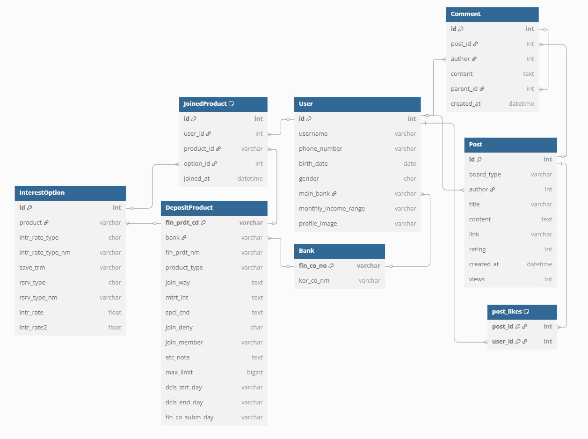

# 프로젝트 README

## I. 팀원 정보 및 업무 분담 내역

| 이름      | 담당 업무                                                                                                           |
| ------- | --------------------------------------------------------------------------------------------------------------- |
| **박민수** | - Vue.js를 활용한 프론트엔드 디자인<br>- UI/UX 설계 및 프론트엔드 총괄<br>- Kakao Maps API를 통한 은행까지 경로 탐색 기능 구현                       |
| **조영우** | - 금융 상품 가입 및 장바구니 담기 기능 구현<br>- 사용자 로그인 및 인증 시스템 구축<br>- 금융상품 추천 시스템 개발<br>- Kakao Maps API를 활용한 주변 은행 탐색 기능 구현 |
| **유태영** | - ChatGPT API를 활용한 상품 추천 로직 구현<br>- 사용자 자산 시뮬레이션 기능 개발<br>- 메인페이지 금융 뉴스 및 금융상품 카드 컴포넌트 구현                       |


## II. 아키텍처 및 기술 스택

본 프로젝트는 프론트엔드와 백엔드를 완전히 분리한 SPA 구조로, RESTful API를 통해 통신합니다.

- **Frontend**: Vue 3, Pinia, Vue Router, Axios
- **Backend**: Django, Django REST Framework
- **AI & 외부 API**: ChatGPT API, Kakao Maps API, YouTube API

> 프론트엔드는 사용자 인터페이스 및 시각화를, 백엔드는 데이터 처리 및 비즈니스 로직을 담당합니다.


## III. 데이터베이스 모델링 (ERD)



### 핵심 모델 요약

- **User**: 사용자 기본 정보 / `main_bank` 외래키 / `JoinedProduct`를 통한 상품 연결
- **Bank**: 고유 식별자 `fin_co_no` / 예적금 상품과 1:N
- **DepositProduct**: 은행과 연결 / `InterestOption` 및 `JoinedProduct`와 1:N
- **InterestOption**: 금리 옵션 / `JoinedProduct`를 통해 사용자와 연결됨
- **JoinedProduct**: `User` ↔ `DepositProduct` ↔ `InterestOption` 연결하는 중간 테이블 (unique constraint)
- **Post / Comment / post_likes**: 게시판, 댓글, 좋아요 등 커뮤니티 기능을 구성


## IV. 금융상품 추천 알고리즘

본 추천 시스템은 사용자의 기본 정보를 바탕으로 금융상품을 필터링하고,  
AI를 활용하여 개인 맞춤형 추천을 제공하는 구조로 설계되었습니다.  
현재는 시제품 단계의 단순화를 고려해 핵심 기능 중심으로 구현되어 있으며,  
향후에는 다양한 요소를 반영하여 더욱 정교한 시스템으로 고도화할 계획입니다.

---

### 1. 현재 구현 기능

#### 기본 필터링 로직
사용자의 **연령과 자산 수준**을 기반으로 금융상품 후보군을 간단히 분류합니다.  
아래 기준에 따라 1차 필터링이 수행됩니다:

- **젊고 자산이 많은 사용자**: 장기 투자에 적합한 고수익 상품 위주 추천  
- **젊고 자산이 적은 사용자**: 단기 유동성이 높은 상품 우선 추천  
- **40세 이상 사용자**: 안정성과 신뢰도를 중시한 주요 시중은행 상품 위주 추천

#### AI 기반 개인화 추천
사용자가 'AI 추천' 기능을 실행하면, 필터링된 후보군과 함께  
사용자의 연령, 자산, 투자 성향 등의 정보가 포함된 프롬프트를 **OpenAI API**에 전달합니다.  
ChatGPT는 이를 분석하여 다음을 수행합니다:

- 최적의 **3개 금융상품 추천**
- 각 상품에 대해 **사용자 맞춤형 설명 문구 생성**

이를 통해 **사용자의 맥락을 고려한 설득력 있는 추천 결과**를 제공합니다.

---

### 2. 향후 확장 방향

현재 알고리즘은 서비스 구조와 데이터 흐름을 검증하기 위한 초기 구현입니다.  
향후에는 다음과 같은 요소들을 반영한 **다차원 복합 추천 시스템**으로 발전시킬 계획입니다:

- **투자 성향 분석** (공격형, 중립형, 안정형 등)
- **자산 흐름 및 소비 패턴** 분석 (예: 저축 중심 vs 소비 중심)
- **단기/장기 재무 목표 기반 분류** (결혼자금, 주택 구입, 은퇴 준비 등)
- **가입 이력 및 관심 상품 이력** 활용한 연속 추천
- **금융시장 동향 및 금리 추이** 반영
- **사용자 행동 로그 기반 재추천 기능** (예: 클릭/선호/방문 이력 등)

---

이러한 고도화를 통해 단순한 수치 기반 필터링을 넘어,  
**사용자의 재무적 맥락과 목적에 최적화된 맞춤형 금융상품 추천**을 지향합니다.


## V. 서비스 대표 기능 설명

### 1. 예적금 금리 비교

* 금융상품 통합비교 API를 통해 예금과 적금 상품 데이터를 받아 DB에 저장하고, 사용자가 가입 기간 및 은행 선택을 통해 필터링된 상품 목록을 확인할 수 있도록 구성했습니다.
* 각 상품의 상세정보 조회 및 가입 기능을 제공합니다.

### 2. 금융 상품 추천 기능 

* 사용자의 연령과 자산 규모를 기반으로 맞춤형 금융 상품을 추천합니다.
* 은퇴 자산 예측을 위해 몬테카를로 시뮬레이션을 적용하여 다양한 미래 시나리오를 제공합니다.

### 3. 은퇴 자산 시뮬레이션

* 사용자의 현재 자산과 나이를 기반으로, 은퇴 시점까지의 자산 변화를 예측하는 시뮬레이션 기능을 제공합니다.
* 몬테카를로 기법을 활용하여 다양한 수익률 및 금리 변동 시나리오를 생성하고, 그 결과를 히스토그램과 누적 분포 차트로 시각화합니다.
* 이를 통해 사용자는 미래 자산에 대한 불확실성을 직관적으로 파악할 수 있습니다.

### 4. 근처 은행 검색

* Kakao Maps API를 이용하여 사용자가 선택한 위치 근처의 은행 정보를 지도에 시각적으로 표시합니다.
* 은행을 선택하면, 현재 위치에서 은행까지의 길을 표시합니다.

### 5. 현물 상품(금, 은) 가격 비교

* 금과 은의 가격 변동을 시각화한 차트를 제공하며, 특정 기간을 선택하면 해당 기간의 데이터만 표시됩니다.

### 6. 관심 종목 영상 검색

* Youtube API를 활용해 사용자가 입력한 검색어로 영상을 검색하고, 영상 목록 및 상세페이지를 제공합니다.

### 7. 커뮤니티 게시판

* 회원 간의 소통을 위한 게시판을 제공하며, 게시글 및 댓글 작성, 수정, 삭제는 작성자 본인만 가능합니다.

### 8. 프로필 페이지

* 사용자 정보 조회 및 수정 기능을 제공하며, 가입한 금융 상품 리스트와 금리 정보를 차트로 시각화하여 제공합니다.


## VI. 생성형 AI를 활용한 부분

- **ChatGPT API를 통한 금융상품 추천 로직 구현**
  - 사용자의 자산, 나이, 성향 등 다양한 입력 조건을 기반으로 AI가 문맥을 이해하고 자연어 기반의 추천 이유를 생성합니다.
  - 단순 알고리즘 추천이 아닌, 사용자에게 이해하기 쉬운 설명을 함께 제공함으로써 서비스의 신뢰성과 설득력을 강화했습니다.

- **ChatGPT를 활용한 실질적 설계 및 협업 생산성 향상**
  - ERD 설계, 모델 구성, 커밋 메시지 전략 수립 등 설계 초기 단계에서 ChatGPT를 적극 활용하여 문서화 품질과 개발 속도를 크게 향상시켰습니다.
  - 프론트엔드와 백엔드 간 API 통신 방식 정리, 역할 분리 기준 수립 등 설계 의사결정을 신속하게 정리하는 데에도 실질적인 도움이 되었습니다.
  - 단순한 코드 생성이 아닌, **아이디어 정리 → 구조 설계 → 의사소통 자료화** 전반에 걸쳐 GPT를 도구로 활용하는 업무 흐름을 경험했습니다.


## VII. 협업 및 회고

- **협업의 가치**  
  처음부터 역할을 분담하고 API 명세를 명확히 정의함으로써 효율적인 협업이 가능했습니다. GitHub를 통한 버전 관리는 팀워크를 정립하는 데 큰 도움이 되었습니다.

- **기술 스택에 대한 실전 경험**  
  Django REST Framework를 활용한 RESTful API 설계 및 인증 시스템 구축, Vue 3 + Pinia를 이용한 상태 관리와 컴포넌트 기반 UI 개발 등 각 기술을 구현하며 감각을 익혔습니다.  
  특히, 프론트와 백 간의 비동기 통신, 컴포넌트 간 데이터 흐름 등을 직접 설계하고 디버깅하며 기술에 대한 깊이 있는 이해를 쌓을 수 있었습니다.

- **후속 목표**  
  향후에는 추천 알고리즘을 사용자 행동 데이터 및 실거래 이력과 연동해 더욱 정교화하고,  
  피드백 수집 시스템을 도입하여 반복적인 개선 사이클을 구축하는 등,  
  실사용에 가까운 금융 추천 서비스로 발전시키는 것을 목표로 하고 있습니다.


## VIII. 커밋 메시지 컨벤션

| 타입         | 설명                         |
|--------------|------------------------------|
| `feat`       | 새로운 기능 추가             |
| `fix`        | 버그 수정                    |
| `docs`       | 문서 관련 변경               |
| `refactor`   | 리팩토링 (기능 변화 없음)    |
| `style`      | 코드 포맷팅/스타일 변경      |
| `test`       | 테스트 코드 추가/수정        |
| `chore`      | 설정, 빌드 등 기타 변경       |

예시:

```
feat: 예적금 추천 알고리즘 초기 버전 구현  
fix: 영상 검색 결과 undefined 오류 해결  
docs: ERD 이미지 경로 수정  
refactor: InterestOption 모델의 중복 로직 정리  
```


## IX. 사용 흐름

1. 레포지토리를 클론하고 `.env.example` 파일을 참고하여 `.env` 파일을 설정합니다. (백엔드 및 프론트)

2. 백엔드
- 가상환경을 구성하고 의존성을 설치합니다.
- `python manage.py migrate` DB 스키마를 반영하고,
- `python manage.py collect_deposit` 예·적금 데이터를 수집한 뒤,
- 개발 서버를 실행합니다.

3. 프론트엔드
- 의존성을 설치하고 개발 서버를 실행합니다.

> 백엔드와 프론트엔드 서버는 각각 독립적으로 실행됩니다.


## X. 파일 구조

```
final_pjt/
├── backend/
│   ├── accounts/               # 유저 인증 및 금융상품 가입
│   ├── api/                    # 기타 API (지도, 영상)
│   ├── community/              # 게시판 기능
│   ├── products/               # 금융상품 관련 모델 및 추천 로직
│   ├── simulation/             # 자산 시뮬레이션 기능
│   ├── fixtures/               # 더미 데이터 JSON
│   ├── manage.py
│   └── backend/                # Django 설정
│       ├── settings.py
│       └── urls.py
├── frontend/
│   ├── public/                 # 이미지 및 아이콘 자산
│   ├── src/
│   │   ├── components/         # UI 컴포넌트
│   │   ├── views/              # 주요 페이지 컴포넌트
│   │   ├── stores/             # Pinia 상태 관리
│   │   ├── assets/             # 이미지 및 데이터 파일
│   │   └── main.js             
│   ├── index.html
│   ├── package.json
│   └── vite.config.js
├── docs/
│   └── erd.png
└── README.md

```
